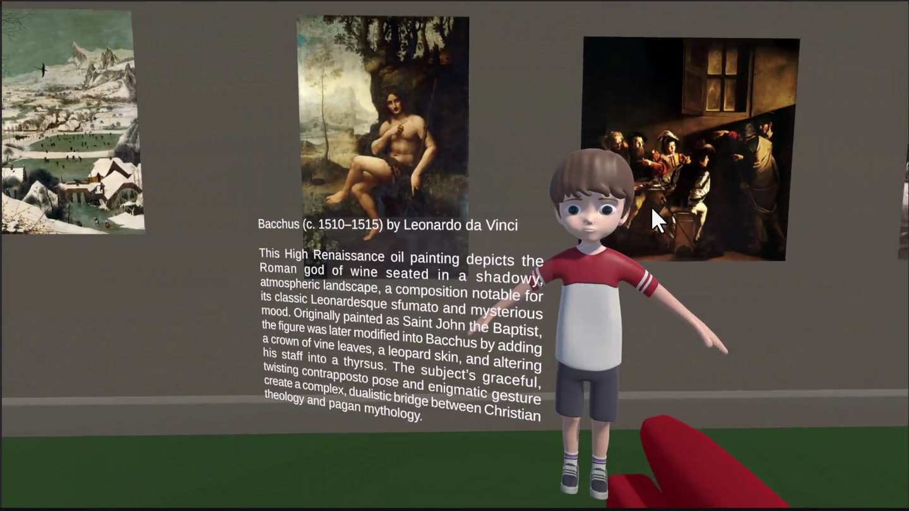
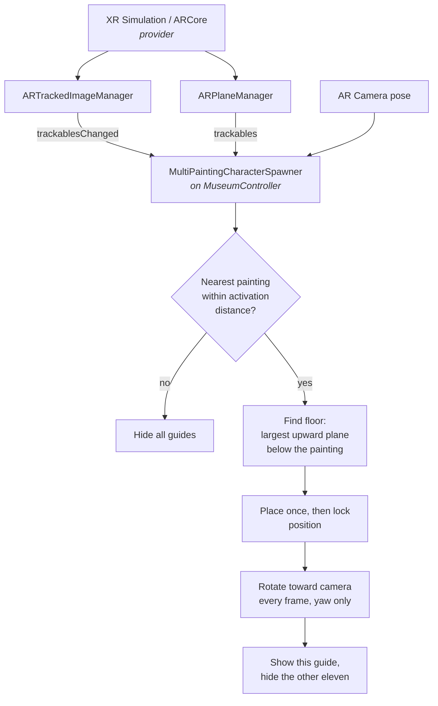

<div align="center">

# The Augmented Museum

**An augmented reality museum guide built with Unity 6 and AR Foundation.**

Twelve paintings. Twelve guides. One controller that decides who is nearest,
places them on a floor it had to find for itself, and turns them toward you.

[](https://unity.com/releases/editor/whats-new/6000.0.40)
[](https://docs.unity3d.com/Packages/com.unity.xr.arfoundation@6.0/manual/index.html)
[](https://docs.unity3d.com/Packages/com.unity.xr.arcore@6.0/manual/index.html)
[](#)
[](LICENSE)

[Demo video](docs/demo.mp4) · [Full technical report](docs/The_Augmented_Museum_Report.docx)

</div>

---

## Overview

A visitor walks through a gallery holding a phone. As they approach a painting, the
application recognises the artwork, a virtual guide appears standing on the floor beside
the frame, turns to face the visitor, and opens a panel describing the work. Walk away
and the guide disappears. Walk to the next painting and its own guide takes over.

The application covers twelve works spanning four centuries, from Duccio's *Maestà*
(1308) to Gainsborough's *The Blue Boy* (c. 1770). It was developed and validated
entirely in **XR Simulation**, which runs the full AR stack inside the Unity Editor
against a virtual room, and is configured to build for Android through **Google ARCore**
without code changes.

<div align="center">

</div>

---

## What makes it interesting

Most image-tracking demos parent a cube to the marker. This one parents nothing.

The design combines **two independent AR subsystems** to answer two different questions:

| Question | Answered by | How |
|---|---|---|
| *Which painting, and in which direction?* | `ARTrackedImageManager` | The tracked image pose supplies identity plus two basis vectors along the wall |
| *How high is the ground?* | `ARPlaneManager` | The largest upward-facing tracked plane below the painting |
| *Who should be visible?* | `MultiPaintingCharacterSpawner` | Nearest tracked painting inside its own activation radius, everything else hidden |

Separating those responsibilities is what made the system debuggable. When something
broke, the failure told us which of the three to look at.

---

## How it works



### Placing the guide

The position is three terms, computed once from the tracked image transform and then
frozen:

```csharp
sideDirection = ProjectOnPlane(trackedImage.transform.right, Vector3.up).normalized;
wallNormal    = ProjectOnPlane(trackedImage.transform.up,    Vector3.up).normalized;

// Flip the normal so the guide always appears on the visitor's side of the wall
if (Vector3.Dot(wallNormal, directionToCamera) < 0f)
    wallNormal = -wallNormal;

characterPosition   = imagePosition
                    + sideDirection * entry.sideOffset      // 1.15 m along the wall
                    + wallNormal    * entry.wallOffset;     // 0.35 m into the room

characterPosition.y = floorY + entry.characterGroundOffset; // from plane detection
```

Both basis vectors are projected onto the horizontal plane first, so a painting hanging
a degree off vertical cannot tip the guide into the floor.

### Finding the floor

A downward `ARRaycastManager` query was the obvious approach and it did not work: it
returned no hit even in a room full of tracked planes. The shipping implementation reads
`ARPlaneManager.trackables` directly and selects the largest plane that is currently
tracking, faces upward, and sits below the painting. In a room, that is the floor rather
than a chair, a shelf or a desk.

```csharp
bool facesUp = plane.alignment == PlaneAlignment.HorizontalUp
            || Vector3.Dot(plane.transform.up, Vector3.up) > 0.9f;
```

Testing the alignment enum and the dot product together rejects planes reported as
horizontal whose normal is not quite vertical.

### Facing the visitor

Rotation is constrained to yaw. The camera's height is replaced with the character's own
before the look direction is taken, so the guide never tilts back as the visitor crouches
or stands.

Position and rotation are deliberately decoupled: the position is computed once and
locked, while the rotation keeps following the camera. Recomputing both on every tracking
update made the guide drift sideways as the visitor moved.

---

## Tech stack

| Component | Version | Role |
|---|---|---|
| Unity | 6000.0.40f1 | Engine, editor, prefab and UI workflow |
| AR Foundation | 6.0.7 | Trackable API: image tracking, plane detection, raycasting, camera pose |
| Google ARCore XR Plugin | 6.0.7 | Android provider, configured and ready to build |
| XR Simulation | bundled with AR Foundation | Desktop provider used for all development and testing |
| XR Simulation Environments | 2.0.1 | Supplies the Office environment used as the gallery |
| TextMeshPro | bundled | World-space information panels |

**Why AR Foundation rather than Vuforia.** Vuforia is excellent at image and object
targets, and for pure marker tracking it would have been sufficient. The deciding
requirement was the combination: image tracking *and* plane detection together, because
the guide has to stand on a real floor next to a recognised painting. AR Foundation
exposes both through one trackable API, and its simulation provider allowed both to be
tested without a device and without a physical gallery.

---

## Repository structure

```
.
├── Assets
│   ├── Characters/Models      Guide character (Generic rig)
│   ├── Materials              Wall, floor and character materials
│   ├── Paintings
│   │   ├── Images             Twelve source artworks
│   │   └── Libraries          MuseumPaintingLibrary (XR Reference Image Library)
│   ├── Prefabs                Twelve guide prefabs, one per painting
│   ├── Scenes                 MuseumAR.unity  ← the application scene
│   ├── Scripts                MultiPaintingCharacterSpawner.cs  ← the only script
│   ├── Simulation             Office.prefab, the gallery environment
│   └── UI                     Panel assets
├── ContentPackages            XR Simulation Environments package (resolved by manifest)
├── Packages                   Package manifest
├── ProjectSettings            Unity project settings
└── docs
    ├── demo.mp4               Recorded walkthrough
    └── The_Augmented_Museum_Report.docx
```

The scene hierarchy is intentionally minimal. No guide exists at edit time.

```
MuseumAR
├── Directional Light
├── XR Origin          AR Camera, ARTrackedImageManager, ARPlaneManager, ARRaycastManager
├── AR Session
└── MuseumController   MultiPaintingCharacterSpawner
```

---

## Getting started

**Requirements:** Unity 6000.0.40f1 or later in the Unity 6 line.

```bash
git clone https://github.com/Mojtaba-Alehosseini/augmented-museum-ar.git
```

1. Open the project in Unity. AR Foundation, ARCore and the simulation environments
   resolve from `Packages/manifest.json`.
2. Open `Assets/Scenes/MuseumAR.unity`.
3. Open the **XR Environment** view and select the **Office** environment.
4. Enter Play Mode and move through the gallery with the Game view navigation controls.
5. Approach any painting. Inside its activation distance the guide appears beside it with
   that artwork's panel.

### Building for Android

Switch the build target to Android and enable the Google ARCore plug-in under
**XR Plug-in Management**. No code changes are required, but see the note on
`Max Number of Moving Images` below.

---

## Configuration

Every painting is one serialised entry on `MuseumController`, so adding a thirteenth
artwork requires no code:

| Field | Value used | Purpose |
|---|---|---|
| `imageName` | e.g. `4_arnolfini_15th` | Must match the reference image library exactly |
| `characterPrefab` | one of `Assets/Prefabs/0`–`11` | Guide model plus that painting's panel |
| `activationDistance` | 4 m (paintings 1–3), 3.5 m (4–12) | When the guide wakes up |
| `sideOffset` | 1.15 m | Slides the guide along the wall, clear of the frame |
| `wallOffset` | 0.35 m | Brings the guide out into the room |
| `characterGroundOffset` | 0 | Zero because the prefab pivot sits at the feet |
| `yawOffset` | 0 | For models whose forward axis is not +Z |

Guide prefabs use a wrapper root at scale 0.6 with the imported model as a child. The
wrapper is the logical pivot, positioned between the character's shoes, which is the
point dropped onto the detected floor. Without it, rotating the guide swung the model
around a wide arc instead of turning it in place.

Information panels are world-space Canvases of 600 × 300 units at scale 0.004, roughly
2.4 × 1.2 m in the room, so they read like objects standing in the gallery rather than a
heads-up overlay.

---

## Engineering notes

A few findings worth recording, since each one cost real time.

**Tracked images do not use Quad axes.** In XR Simulation a tracked image uses local X
across the picture, local Z toward the top, and local **Y as the surface normal** pointing
out of the wall. Rotating paintings as if they were Quads left them lying flat like
tables, and later produced guides placed inside walls. The placement code depends on this
convention directly through `transform.right` and `transform.up`.

**`Max Number of Moving Images` is a provider-specific trap.** The value is 5 in the
committed scene and all twelve paintings track anyway, because the XR Simulation provider
does not enforce it. The property comment in `SimulationImageTrackingSubsystem.cs` states
that the requested maximum is unused since all images in a simulated environment can move
regardless. ARCore *does* enforce it, so this is the first setting to raise before an
Android build. Early on it was misdiagnosed as the cause of paintings not activating; the
real causes were mismatched reference names, a rounded physical size, and an incorrect
local orientation on the artworks configured last.

**Physical sizes must match exactly.** The size on the reference image library entry and
the size on the simulated tracked image have to be identical, not rounded. Entering
`0.89` where the library holds `0.886875` returns the trackable at the wrong scale.

**Reference names are load-bearing.** The controller resolves paintings by
`trackedImage.referenceImage.name`. The same string appears in the image library, the
simulated tracked image, the controller entry, and the generated character object name. A
typo removes a painting from the experience silently.

---

## Known limitations

- **The guide is static.** The character model lacks the fifteen bones Unity requires for
  a Humanoid Avatar, so it is imported with a Generic rig. Animation was out of scope.
- **Validated in simulation only.** Real tracking is affected by lighting, glare on
  varnish and glass, camera quality and true printed size, none of which the simulator
  models.
- **The floor heuristic is environment-dependent.** "Largest upward-facing plane below
  the painting" holds in a room. A hall with a low platform or mezzanine would need the
  candidate height compared against the camera height as well as the area.
- **No visual coherence work.** There is no light estimation, no shadow and no environment
  occlusion, so the guide is composited over the room rather than seated in it.
- **Visual only.** No narration or audio description.

---

## Roadmap

- [ ] Fully rigged character with idle, speaking and pointing animations
- [ ] Text-to-speech narration and audio description for accessibility
- [ ] Multiple languages
- [ ] Period-specific guides, so the 14th-century wall differs from the 18th
- [ ] Tap-to-expand interaction and subtitles
- [ ] Android build tuned against real printed artworks
- [ ] Light estimation and environment occlusion
- [ ] Purpose-built gallery environment with frames and gallery lighting

---

## Documentation

The [technical report](docs/The_Augmented_Museum_Report.docx) covers the design and
implementation decisions in full, including the SDK evaluation, the scene setup, every
problem encountered with its diagnosis, the test matrix and the limitations.

The [demo video](docs/demo.mp4) is a recorded walkthrough of all twelve paintings running
in XR Simulation.

---

## Author

**Mojtaba Alehosseini**

Developed for the Augmented Reality course, MSc programme, University of Genoa (UniGe).

## License

Code is released under the [MIT License](LICENSE).

Third-party assets retain their original licences: the Unity XR Simulation Environments
package, the imported character model, and TextMeshPro are covered by their respective
terms. The twelve artworks are public-domain reproductions of works created between 1308
and c. 1770.
